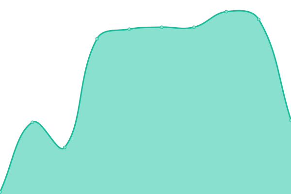

# [📈 Live Status](https://NetaMx.github.io/upptime-qa): <!--live status--> **🟧 Partial outage**

This repository contains the open-source uptime monitor and status page for [NetaMx](https://neta.mx/), powered by [Upptime](https://github.com/upptime/upptime).

With [Upptime](https://upptime.js.org), you can get your own unlimited and free uptime monitor and status page, powered entirely by a GitHub repository. We use [Issues](https://github.com/NetaMx/upptime-qa/issues) as incident reports, [Actions](https://github.com/NetaMx/upptime-qa/actions) as uptime monitors, and [Pages](https://NetaMx.github.io/upptime-qa) for the status page.

<!--start: status pages-->
<!-- This summary is generated by Upptime (https://github.com/upptime/upptime) -->
<!-- Do not edit this manually, your changes will be overwritten -->
<!-- prettier-ignore -->
| URL | Status | History | Response Time | Uptime |
| --- | ------ | ------- | ------------- | ------ |
|  NetaMx Site | 🟩 Up | [neta-mx-site.yml](https://github.com/NetaMx/upptime-qa/commits/HEAD/history/neta-mx-site.yml) | 

 289ms
     
 | 

<a href="https://qa.status.ops.neta.mx/history/neta-mx-site">69.65%</a>
    

|  Mi Tienda | 🟥 Down | [mi-tienda.yml](https://github.com/NetaMx/upptime-qa/commits/HEAD/history/mi-tienda.yml) | 

 0ms
     
 | 

<a href="https://qa.status.ops.neta.mx/history/mi-tienda">0.00%</a>
    

<!--end: status pages-->

[**Visit our status website →**](https://NetaMx.github.io/upptime-qa)

## 📄 License

- Powered by: [Upptime](https://github.com/upptime/upptime)
- Code: [MIT](./LICENSE) © [NetaMx](https://neta.mx/)
- Data in the `./history` directory: [Open Database License](https://opendatacommons.org/licenses/odbl/1-0/)
